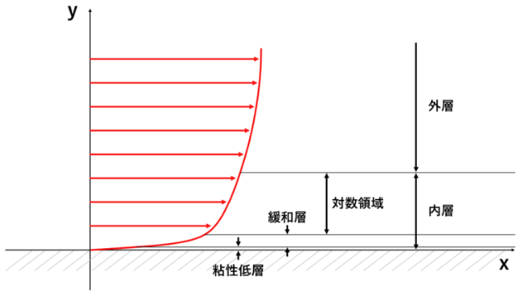
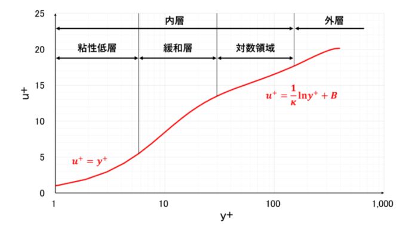

# 無次元数
## Weber数
Weber数$We$は以下の式で定義される．

$$
We = \frac{\rho u^2 L}{\sigma}
$${#eq:Weber_number}

ここで$\rho$は流体密度，$u$は流速，$L$は代表長さ，$\sigma$は表面張力である．慣性力と表面張力の比である．流体中で表面張力により形を保とうとする挙動と，慣性力で変形・分裂する挙動の比較として用いられる．$We$が小さいとすなわち表面張力が支配的であり，液滴などが球形を保つと理解できる．

# テイラー展開
無限微分可能な関数$f(x)$について，

$$
\begin{aligned}
f(x) &= f(a) + f'(a)(x-a) + \frac{f''(a)}{2!}(x-a)^2 + \cdots + \frac{f^{(n)}(a)}{n!}(x-a)^n + \cdots\\
&= \sum_{n=0}^{\infty} \frac{f^{(n)}(a)}{n!}(x-a)^n
\end{aligned}
$${#eq:Taylor_expansion}

を$f(x)$の$x=a$のテイラー展開という．特に$a=0$としたものをマクローリン展開という．ここで，テイラー展開の証明には踏み込まない．重要なことは，ある連続関数$f(x)$[^about_f]を多項式で近似的に離散化（Discrerization）できることである．テイラー展開はあくまで関数の近似であり，何次の項で打ち切るかで打ち切り誤差が生れる．

[^about_f]:本来はある関数が連続かどうかは証明が必要だが，工学分野で利用する関数は連続である，または暗黙的に連続の範囲のみを扱うことが多い．

例えば2次まで展開をするとき

$$
f(x) = f(a) + f'(a)(x-a) + \frac{f''(a)}{2!}(x-a)^2 + O(x^3)
$${#eq:Taylor_expansion_3rd}

と記述し，$O(x^3)$は剰余項である．ここが打切り誤差となる．高次展開には当然ながらメリットデメリットがある．一般には2次精度程度でよいらしい．というのも，一般的には打切り誤差よりもメッシュの切り方や物理モデルが誤差の支配要因であることが多いためである．

* 高次展開のメリット
  * 剰余項の誤差（Truncation error）が小さくなり，スキームの空間・時間精度が向上する．
  * すくないメッシュ数で精度を保てる
  * 渦，境界層などの構造を保ちやすい
* 高次展開のデメリット
  * 数値振動が起きやすく，物理現象を正しく反映できないことがある．この対策としてTVD，WENOなどの制限器を使用する場合がある．
  * 計算コスト上昇により計算時間やメモリが増加する．
  * 計算安定のためのCFL条件が厳しくなることがある．

数値計算のモデルなどでよく使う形式は，例えば微小要素の中のある物理量$f(t)$が時刻$\Delta t$後に$f(t+\Delta t)$になるような場合である．この時，テイラー展開すれば

$$
\begin{aligned}
f(t+\Delta t) &= f(t) + \Delta t\, f'(t) + \frac{(\Delta t)^2}{2!} f''(t) + \frac{(\Delta t)^3}{3!} f^{(3)}(t) + \cdots\\
&\approx f(t) + \frac{\partial f}{\partial t} \Delta t + \frac{1}{2} \frac{\partial^2 f}{\partial t^2} (\Delta t)^2 + O(t^3)
\end{aligned}
$${#eq:Typical_Taylor_expansion_CFD}

とかける．2次以降の項を打ち切り，$f(t+\Delta t) \approx f(t) + \frac{\partial f}{\partial t} \Delta t$とすることがもっぱらである．

# グリッド独立性調査
数値計算をするうえで，適切なメッシュサイズ（＝グリッドサイズ）であることを示す必要がある．メッシュが粗すぎれば誤差が大きくなり，メッシュが細かすぎれば計算リソースを不必要に割くことになる．一般的にはメッシュサイズを変えながら，ある固定した位置での物理量を比較し，変化が十分に小さいことを確認する．物理量としてはその流れを代表できるものが望ましい．例えばポワズイユ流れであれば解析解として得られる出口中心部の流速が候補にあがる．

定量的な判定のために，まずは細分化比$r$を定義する．3つのノード数を用意し，細かいほうから$N_1$,$N_2$,$N_3$とする．ここで，$N_1/N_2 = N_2/N_3$とする．このとき細分化比は

$$
r = \left( \frac{N_1}{N_2} \right) ^{1/D}
$${#eq:Refinement_ratio}

として定義される．ここで$D$は問題の次元であり，平面モデルであれば$D=2$，立体モデルであれば$D=3$となる．

## リチャードソン外挿法
2次精度スキームの時，推定誤差はターゲット変数$f$を用いて

$$
\varepsilon = \frac{f_1 - f_2}{r^2 - 1}
$${#eq:Error_Richardson}

である．この推定誤差が許容範囲にあるかを判断基準とする．例えば$\varepsilon < 0.01$など．これを満たしたとき，その計算はグリッドから独立していると判定できる．

## 漸近的収束
解が漸近領域にあるかどうかを確認する．収束指標として

$$
\frac{f_2 - f_3}{f_1 - f_2} \approx r^p
$${#eq:index_asymptotic_range}

を定義する．この値が一定になるようなノード数の組み合わせで解が漸近領域に入っていると判断できる．漸近領域の中で最も粗いメッシュサイズが最適メッシュサイズとして採用される．

# 乱流モデル
## 乱流の概要とRANS方程式
層流は時間変動が規則的で，決定論的に解くことができる．一方で乱流は不規則な時間変動項が存在し，NS方程式で直接解くことは現実的ではない．層流と乱流の違いは一般に$Re$数で整理される．流体の密度$\rho$，粘性係数$\mu$，代表速度$u$，代表長さ$l$を用いて

$$
Re = \frac{\rho u l}{\mu}
$${#eq:def_Re}

と定義される．これは慣性力と粘性力の比考えることができる．$Re$数は層流と乱流の状態の目安を与えるが，条件ごとに大きく変動する．例えば円管流れでは$Re=2000 \sim 4000$程度で乱流に遷移する．

乱流の特徴は不規則な変動をする渦である．渦は層流でも存在するが，層流の場合は粘性の効果により渦が規則的になり，ある渦サイズで平衡状態になる．一方乱流の場合はエネルギーカスケードと呼ばれる作用により，乱流エネルギーが大きな渦から小さな渦へと伝達され，最初に生成された大きな渦は最終的にコロモゴフスケールと呼ばれる最小サイズまで小さくなり，熱として散逸する．最初の最大の渦サイズは流れの代表長さ$l$に制限され，最小の渦のスケール（散逸領域のスケール＝コロモゴフスケール）$\eta$は

$$
\eta/l \sim Re^{(-3/4)}
$${#eq:Kolmogoh_scale}

と表される．乱流をNS方程式で直接解く（DNS）場合，コロモゴフスケールまで空間を表現する必要があるため，メッシュがかなり小さくなる．合わせて時間刻みも小さくする必要があるため，実用上不可能なレベルの計算リソースを割くことになってしまう．そのため，乱流ではある物理量$f$を時間平均値$\bar{f}$と時間変動値$f'$に分けるレイノルズ分解によって$f = \bar{f}+f'$として扱う．この分解を Navier–Stokes 方程式に代入すると，時間平均流れに対する方程式が得られるが，新たにレイノルズ応力項 $\overline{u'_i u'_j}$ が現れる．この項は未知量を増やす[^closure_problem]ため，追加のモデルによって近似する必要がある．このようにして平均流れを求める手法が Reynolds Averaged Navier–Stokes（RANS）方程式である．この近似のためにBoussinesq仮定や渦粘性などおいた様々なモデルが提案されており，代表的なものに$\kappa - \epsilon$モデルや$\kappa - \omega$モデルなどがある．

[^closure_problem]:これをレイノルズ応力は運動量を輸送するという意味で応力のように振る舞うため「見かけの応力」とも呼ばれる．このレイノルズ応力は未知数であるため，式の数と合わなくなり，式が閉じない．さらにレイノルズ応力についての方程式を作ったとしても，高次の相関項が現れ，やはり式は閉じない．これを乱流のクロージャー問題という．クロージャー問題を解決するため，レイノルズ応力をモデル化した乱流モデルが考案され広く用いられる．

## 壁法則
乱流を RANS 方程式で解く際，特に壁近傍の取り扱いには注意が必要である．これは RANS 特有の問題というよりも，空間離散化を伴う数値流体解析において一般的に現れる問題である．壁面では no-slip 条件により速度がゼロであり，壁から離れるにしたがって速度は急激に増加する．すなわち壁近傍では速度勾配が非常に大きくなる．そのため境界層内部の流れを正確に解くためには極めて細かいメッシュが必要となる．さらに乱流境界層では，壁近傍において粘性の影響と乱流の影響が同時に強く現れるため，乱流モデルの適用が難しい領域となる．このため実用的な乱流解析では，壁近傍の流れを直接解く代わりに，実験的・理論的に知られている平均速度分布を用いてモデル化することが多い．これを壁法則と呼ぶ．

[@fig:Turbulant_boundary_layer]に乱流における境界層の発達の模式図を示す．境界層のうち，壁からの影響が無視できない領域を内層とよび，自由流になっている領域を外層と呼ぶ．壁法則は内層に対して有効である．内層のうち，特に壁面近傍で分子粘性の影響が大きい領域を粘性低層（viscous sublayer），渦粘性の影響が大きい領域を対数領域（log-law layer）と呼び，両者の間の遷移領域を緩和層（buffer layer）と呼ぶ．

{#fig:Turbulant_boundary_layer}

壁法則を考えるにあたって，まずは壁面摩擦速度$u_{\tau}$を以下の通り定義する．

$$
u_{\tau} = \sqrt{ \frac{\tau_{\mathrm{w}}}{\rho}}, \quad \tau_{\mathrm{w}} = \mu \left( \frac{\partial u}{\partial y} \right)_{\mathrm{wall}}
$${#eq:wall_friction_velocity}

これは物理的な速度というよりは，壁面せん断応力の強さだとか，壁面近傍における乱流のスケールという理解をしたほうがよい．このスケールを用いて，距離と速度を無次元化した$y^+$と$u^+$を定義する．すなわち，

$$
y^+ = \frac{u_{\tau} y}{\nu}
$${#eq:yplus}

$$
u^+ = \frac{\bar{u}}{u_{\tau}}
$${#eq:uplus}

ただし，$\nu$は動粘性係数である．さて，この二つの無次元数を用いてプロットすれば，[@fig:Law_of_wall]のようになることが知られている．このうち，粘性低層は理論的に導かれ，$y^+<5$で有効である．また，対数領域は実験的事実から経験的に求められる関係式であり，$y^+ \approx 30 - 300$程度で有効である．両者の間の緩和層は理論的にも実験的にも普遍的なモデルが得られていない．そのため，実際の計算では$y^+$が粘性低層または対数領域になるように壁面近傍のメッシュをきる．一般に流れだけを確認したい場合，例えば車や飛行機周りの流れ場などでは対数領域を用いればよい．粘性低層までメッシュを小さくすれば計算コストが増大するからである．一方，壁面からの熱伝達など壁近傍の物理が重要である場合は粘性低層までメッシュを切る必要がある．いずれにしても，CFDの第一層が緩和層に係らないようにすることが重要である．

{#fig:Law_of_wall}
