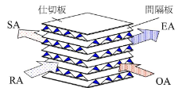
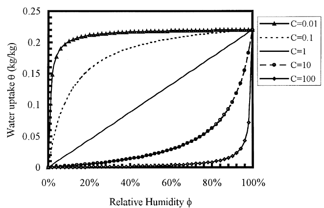

# 緒言
## 背景
建物分野は世界のエネルギー消費のうち30%を占める．ここで空調機の負荷を下げることはCO2排出量抑制に対して地球規模の効果が見込まれる．現代の空調システムとしては一般
に熱交換器とエンタルピー交換器とがある．熱交換機は熱，すなわち顕熱のみを交換する一方で，エンタルピー交換器は水蒸気も交換する．これにより水蒸気が持つ潜熱の交換（顕熱＋潜熱でエンタルピー）の交換も可能になる．Polyblock社はエンタルピー交換器用核膜としてVAPOBLOCを製造・販売している．VAPOBLOCは吸湿性塩を含むPVA,セルロース，PVDF/PES，または特殊ポリマーなどが用いられる．この材料により水蒸気分圧による水蒸気拡散を可能にし，かつウイルスや細菌などの汚染物質をろ過できる．そのため，特に清潔さが重要な病院などにおいて一定のシェアを持つ．しかしながら，本製品は熱効率65-75%，湿度効率60-70%程度であり，一般的な熱交換器の90%程度の熱効率に対抗できない．この原因として膜の機械的弱さがある．膜厚は150-200μm程度であり，圧力差による変形が起こる．この変形は作動環境に依存し，かつ動的に変化するため各顧客に導入するにあたっての設計は簡単ではない．これまでは，同社で保有するデータや逐次的な試験によって経験的な設計が行われてきた．変形を抑制するために，支持構造が用いられる．この支持構造は高い製造負荷や圧力損失，また支持構造のために流体最適化が不可能などの原因となってしまう．上記のような課題から現在は熱交換器が主流となっている．
Polyblock社は本課題を克服したFormFlex HXを開発した．FormFlex HXは支持構造なしで3D形状を維持できる形状安定性を有している（特許番号：USP/EP3094940B1）．そのため支持構造が不要であり，圧力差による変形を考慮しなくてよい．また，本材料はスケーラブルであり住宅用装置から大型商業システムまで幅広く対応可能である．
FormFlex HXは変形が起きないために設計が簡略化される．特に動的変化が起きないことはCFDの導入ハードルを著しく下げ，顧客に対して柔軟なソリューションを提案できる．また，支持構造をなくすことで製造時のCO2排出量を25-30%減少させ，加えて廃棄物も削減することが可能である．
設計が簡略化されるとはいえ，設計空間は依然として広い．水分子の交換効率は一般に膜面積が大きくなるほどに向上するが，同時に膜面積の増加により圧力損失が高まる．また，流れは多くの場合層流であるため，タービュレータ等を導入して熱伝達の向上を図る必要がある．したがってこれらのトレードオフ問題を解かなくてはならない．すなわち，入力変数を膜面積や膜形状などの幾何条件にとり，目的関数をシステム全体の体積や効率，圧力損失とするようなメタモデルの構築が必要となる．

## プロジェクト目標
* FormFlex HXのTRLを現在のTRL5からTRL7まで引き上げる．
* 次世代EWTとして十分な性能を達成する．
  * 温度効率80%以上
  * 湿度効率70%以上
  * 圧力損失200Pa以下
  * 750Paの圧力差でも変形しないこと
  * 製造コストの上昇を現行比で20%以内に抑えること
* システム設計のためのメタモデルの構築

# 全熱交換器一般
## quasi-counter flow

# 理論
## 交換効率
顕熱は温度交換効率，潜熱は湿度交換効率によって定義される．[@fig:POL_flow_schematics]のように各流れを定義する．ただし，各略語は以下の通りである．

* OA: Outer Air．屋外から全熱交換器へと送られる空気
* SA：Supply Air．全熱交換器を経て室内へ供給される空気
* RA：Return Air．室内から全熱交換器へと送られる空気
* EA：Exhausted Air．全熱交換器を経て室外へと排出される空気

{#fig:POL_flow_schematics}

温度を$\theta$，湿度を$\omega$で表せば，それぞれの交換効率$\eta_{\mathrm{t}}$および$\eta_{\mathrm{h}}$は以下のように表せる．

$$
\eta_{\mathrm{t}} = \frac{\theta_{\mathrm{OA}} - \theta_{\mathrm{SA}}}
{\theta_{\mathrm{OA}} - \theta_{\mathrm{RA}}}
$${#eq:temperature_exchange_eff}

$$
\eta_{\mathrm{h}} = \frac{\omega_{\mathrm{OA}} - \omega_{\mathrm{SA}}}
{\omega_{\mathrm{OA}} - \omega_{\mathrm{RA}}}
$${#eq:humid_exchange_eff}

## 支配方程式

### 水分の移動
本解析で最も重要になるのは膜を通過する水分のモデル化である．これから説明するモデルは2001年にJ.L. NiuおよびL.Z. Zhangによって構築され[@Niu2001-es]，その後2025年の最新論文[@Liu2025-mz]に至るまで採用されている．本モデルにおいて，空気中の絶対湿度$\omega$，空気中の相対湿度$\phi$および膜中の絶対湿度$\theta$の三つの水分表示が出てくる．それぞれの定義式は以下のとおりである．

$$
\omega = \frac{m_{\mathrm{vapor}}}{m_{\mathrm{dry \, air}}}
$${#eq:def_omega}

$$
\phi = \frac{p_{\mathrm{vapor}}}{p_{\mathrm{sat}}}
$${#eq:def_phi}

$$
\theta = \frac{m_{\mathrm{vapor}}}{m_{\mathrm{dry \, membrane}}}
$${#eq:def_theta}

ここで$m$は質量，$p$は圧力を示す．空気中における絶対湿度$\omega$と相対湿度$\phi$は以下の式で変換可能である．

$$
p_{\mathrm{v}} = \frac{\omega p_{\mathrm{tot}}}{\omega + 0.622}
$${#eq:p_to_omega}

$$
\begin{aligned}
\frac{\phi}{\omega} &= A - 1.61\phi \\
  &\approx  A\\
  A &= \exp \left( 5294/T\right) \times 10^{-6}
\end{aligned}
$${#eq:phi_to_omega}

ここで[@eq:phi_to_omega]式の第二項は5%以下であり，一般に無視される[@Niu2001-es]．
上記3つの変数を用いてモデル化を行い，最終的には$\omega$のみで表現することを目指す．モデル化にあたって，以下を仮定する．
1. 流れ平面方向の水分子の移動は無視する．これは参考文献[@Niu2001-es]の計算結果による．運転条件によってはこの過程が崩れることもあるため，Pe数が2以上であることを確認すること．
2. 膜の吸湿は平衡状態である．
3. 膜における水分の拡散係数$D_{\mathrm{wm}}$は定数である．
4. 吸湿，脱湿時の吸熱・放熱は定数であり，両者等しい値である．

まず外気から流入してくる供給空気の湿度が$\omega_{\mathrm{sa}}$であり，全熱交換エレメントを通過する際に膜表面における空気中の吸湿量が$\omega_{\mathrm{ms}}$である状態を考える．ここで添え字saはsupplied airであり，msはmambrane surface at supply sideを示している．このとき，水分の移動は空気内の現象である．供給空気での水分の対流拡散係数を$k_{\mathrm{s}}$とすれば，熱拡散のアナロジーから水分のフラックスは以下の式で表される．ただし，$k$の単位は$[\mathrm{kg \; m^{-2} \; s^{-1}}]$である．

$$
j_{\mathrm{s}} = \rho_{\mathrm{sa}} k_{\mathrm{sa}} \left(\omega_{\mathrm{sa}} - \omega_{\mathrm{ms}} \right)
$${#eq:vapor_flux_at_supply}

膜を挟んで反対側，すなわち排気吸気側においても同様の議論により

$$
j_{\mathrm{e}} = -\rho_{\mathrm{ha}} k_{\mathrm{ea}} \left(\omega_{\mathrm{ea}} - \omega_{\mathrm{me}} \right)
$${#eq:vapor_flux_at_exh}
となる．
次に膜内の水分のフラックスを考える．これを考えるにあたって，膜表面の空気の吸湿量が既知のとき，膜表面に平衡状態まで水分が吸着した場合，膜表面に吸着する水分量はどれだけになるだろうか．この吸湿量$\theta_{\mathrm{ms}}$は膜材料に強く依存し，実験的に求める必要がある．例えばVapor absorption analyzer - Hydrosorb-1000[@Zhang2008-sa]などの分析器を用いる．この分析により，sorption curveを取得する．この曲線は横軸に相対湿度$\phi$をとり，縦軸に膜の絶対湿度$\theta$をとる．この曲線は以下の式により結び付けられる．

$$
\theta = \frac{w_{\mathrm{max}}}
{1-C+C/\phi}
$${#eq:sorption_curve}

$C$が主に膜や吸湿材のタイプを示す変数である．例えばもっともよく使用されるシリカゲルは$C \approx 1$であり，ポリマー材料は$C \approx 10$程度を示す．$C$ごとのsorption curveを[@fig:POL_sorption_curve]に示す．

{#fig:POL_sorption_curve}

このsorption curveを実験的に求めることで膜表面における絶対湿度がわかった．この水分が膜中を拡散するとき，膜の拡散係数を$D_{\mathrm{wm}}$とすれば，膜内の水分のフラックスは

$$
j_{\mathrm{m}} = \frac{\rho_{\mathrm{m}} D_{\mathrm{wm}}}{\delta} \left(\theta_{\mathrm{ms}} - \theta_{\mathrm{me}} \right)
$${#eq:vapor_flux_in_membrane}
としてあらわされる．ただし，添え字meはmembrane surface at exhaust sideである．また，拡散係数$D_{\mathrm{wm}}$は$k$と単位が異なることに注意する．すなわち$[\mathrm{kg \; m^{-1} \; s^{-1}}]$である．この式を$\omega$を用いてあらわす．

膜の厚みも考慮した膜抵抗$r_{\mathrm{m}}$を

$$
r_{\mathrm{m}} =\frac{\rho_{a}}{\rho_{m}} \frac{\delta}{D_{\mathrm{wm}}} \psi
$${#eq:moisture_resistance}

$$
\psi = \left(A\frac{\partial \theta}{\partial \phi} \right)^{-1}
$${#eq:CMDR}
として表す．詳細は参考文献[@Niu2001-es]を参照のこと．ここで$\psi$はcoefficient of moisture diffusive resistanceと呼ばれる．式[@eq:phi_to_omega]を用いればこのCMDRは

$$
\begin{align}
\psi &= \left(A\frac{\partial \theta}{\partial \phi} \right)^{-1} \\
  &=  \left( A \frac{\partial \theta}{\partial \omega} \frac{\partial \omega}{\partial \phi} \right) ^{-1} \\
  &= \left( \frac{\partial \theta}{\partial \omega} \right)^{-1} \\
  & \approx \frac{\Delta \omega}{\Delta \theta}
\end{align}
$${#eq:CMDR_rev}
と変形できる．すなわち，膜内の水分のフラックスは

$$
j_{\mathrm{m}} = \frac{\rho_{\mathrm{a}}}{r_{\mathrm{m}}} \left(\omega_{\mathrm{ms}} - \omega_{\mathrm{me}} \right)
$${#eq:vapor_flux_in_membrane_rev}
となる．

ここまでで，式[@eq:vapor_flux_at_supply]，[@eq:vapor_flux_at_exh]，および[@eq:vapor_flux_in_membrane_rev]により，供給側空気から膜へ，膜内部から膜外部へ，膜から排気側空気への水分フラックスがあらわされた．平衡状態の仮定から

$$
j_{\mathrm{s}}=j_{\mathrm{m}}= j_{\mathrm{e}} 
$${#eq:flux_equ}

が成立する．

## 膜の性能評価について

# Fluentを用いた数値解析方法
## 多孔質中の水分移動
2013年時点で「多孔質中の水分移動についてうまく計算できない．そのため，研究者ごとにコードを自作したり，UDFでFluentを回している．」という記述がみられる[@Al-Waked2013-nv]．Fluentにおいて多孔質における流体領域は当時でも水蒸気移動（単なる移流拡散）は標準サポートされていたようなので，多孔質材のうち固体部分で吸着・拡散する水蒸気の取り扱いの話をしていると考えられる．[@Liu2025-mz]においても，2024R1のバージョンでも膜内での質量移動モデルを取り扱っておらず，UDFを用いたとの記述がある．

## 膜内の熱・物質移動
膜は厚みが大きくても100μm程度であり，十分に薄い．膜内の熱・物質移動は等方的と仮定すれば，膜厚が非常に薄いため厚み方向一次元に簡略化される．すなわち，膜内温度$T_{\mathrm{m}}$と膜内水濃度$Y_{\mathrm{v,m}}$について

$$
\frac{\partial^2 T_{\mathrm{m}}}{\partial z^2} = 0
$${#eq:one_dim_temperature}

$$
\frac{\partial^2 Y_{\mathrm{v, m}}}{\partial z^2} = 0
$${#eq:one_dim_vapor_concentration}

である．

## 膜表面での熱・物質移動
低温側・高温側の膜表面における水濃度$Y_{\mathrm{v, mc}}$および$Y_{\mathrm{v, mh}}$はそれぞれ

$$
Y_{\mathrm{v, mc}} = Y_{\mathrm{v, cs}} + a_1 \left( 
  Y_{\mathrm{v, hs}} - Y_{\mathrm{v, mh}}
\right)
$${#eq:Y_v_mc}

$$
Y_{\mathrm{v, mh}} = \frac{
  Y_{\mathrm{v, cs}} + \left( a_1 + a_2 \right) Y_{\mathrm{v, hs}}
}
{a_1 + a_2 + 1}
$${#eq:Y_v_mh}
として求められる．ただし，

# スケジュール
## WP2：2026年6月1日から2026年11月30日まで
WP2ではFormFlex HXを用いたプロトタイプを製作し，分析・測定を行う．測定自体はルツェルン応用大学で行う．このプロトタイプは現行品をFormFlex HXに置き換えたものであり，二次元的なものである．既存のCADや材料，製造情報をまとめる必要がある．

# 疑問
## 調査項目
* 従来のmenbraneで圧力差によって変形しやすいとはどれくらいの圧力差か？
* 熱交換機において熱交換効率はどのように定義されるか？また，一般的な効率はどの程度で，理論上可能な最大の交換効率はどの程度か？
* FormFlex HXの特許はどこが先進的か？
* 従来の膜はどのような素材であり，なぜ変形しやすいか？一方，FormFlex HXはなぜ変形しないか？また，最小曲げ半径や許容引張り・曲げ応力はどの程度か？製造・成型方法は？
* 各国における環境規制が本クライアントの市場制圧において重要そう．EUにおけるErP指令とは？北米におけるASHRAE90.1とは？その他，NYCECC，RLT装置に対する73%効率要求とは？
* FormFlex HXは細菌やウイルスを通さないとあるが，それはどの膜もそうなのでは？逆に熱以外に何を通す？
* 現在の空調市場では熱交換器のほうがエンタルピー交換器よりも優勢らしい．どれくらいの市場レンジなのか？

## Mariusに聞くこと
* ZHAW側のチームメンバーは誰か？Marius, Cristian, Masayaであってるか？また，これまでは昌弥はMariusのもとで仕事していたがこのプロジェクトでもそうか？それともCristianの指示の下で進めるか？
* Proposalを読んでいるが，ZHAWの中での役割分担まではわからない．これは今後ZHAW内で週例MTGをしたりするのか？
* とりあえず今週と来週は先行研究調査に使おうと思うが大丈夫か？それともCristianに指示を仰いだ方がいいか？これまで一人で進めていたので，今回どれだけチームで協力する体制になるのかわからないことが不安．
* プロジェクトのフォルダが見つからなかった．まだ作成されていないのかそれともいつもとは違うディレクトリにあるのか？
* まずは5点の作動点の決定が重要という印象を受けた．これについてはPolyblockが指示してくるのか，それもとZHAWからも提案するのか？

# Polyblock AG社について
1982年創業の熱交換器，エンタルピー交換器，排熱回収器などを扱うメーカー．Winterthurに拠点を置き，これらの機械及び関連部品の製造を行っている．対象はビル，病院，学校，集合住宅，向上などに向けた空調システムや排熱・CO2回収などである．最初はガレージ発のスタートアップらしい．現坐剤の従業員数は正確な値はわからないが数十人規模と推定される．