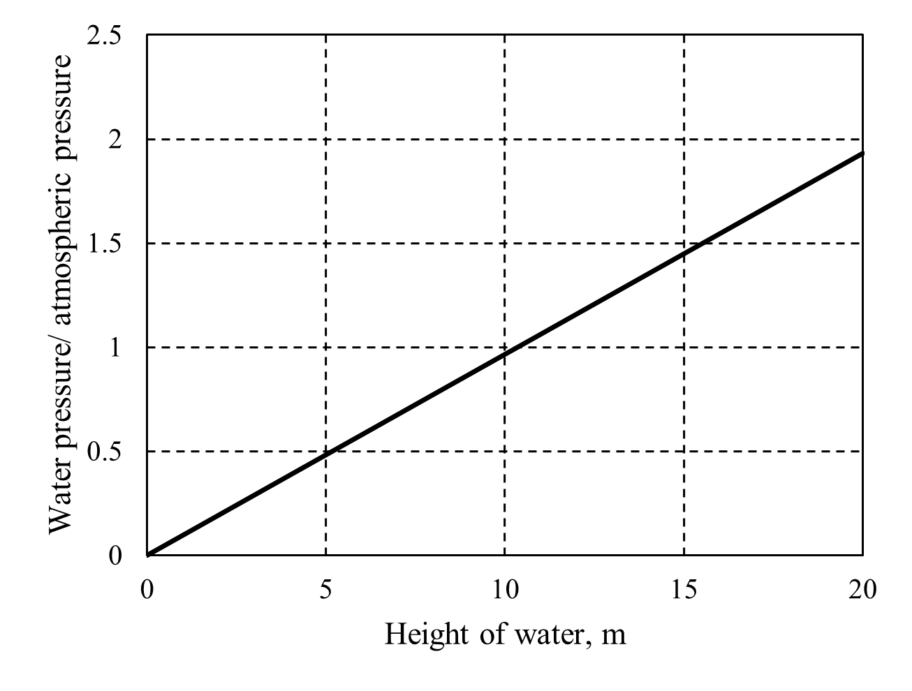
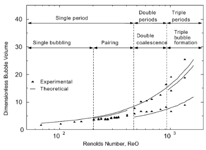
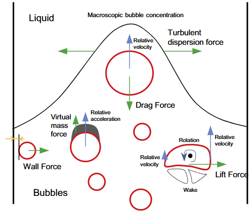

# 混相流のシミュレーション
混相流のシミュレーションにおけるモデル化にあたって，以下を整理する必要がある．
1. 流れは均質（homogeneous）か非均質（Inhomogeneous）か
2. 異相界面を正確に描写する必要があるか否か
3. ドメインに対して必要な空間・時間解像度はどの程度か

# 気泡塔のシミュレーション
以下，水中に空気を注入することを考える．

## クーラン数
気泡塔のシミュレーションは非定常流れにより各時刻での気泡の動きを扱うことになる．そのため，クーラン数は非常に重要である．クーラン数$C$は

$$
C = \frac{v \Delta t}{\Delta x}
$${#eq:Courant_number}

として表される．ここで，$v$は流速，$\Delta t$は時間刻み幅，$\Delta x$はセルの代表長である．クーラン数は数値計算においてある時間刻みにおいて流れが何セル分進むかを表す無次元数である．数値計算において，「情報が伝播する速さ（$\Delta x / \Delta t$）は実際の現象で物理量が伝播する速さ$v$よりも早くなければならない」，すなわち$C < 1$を満たす必要があるというクーラン条件（CFL条件）を表現する重要な値である．たとえば時間刻みを0.01s，要素幅を5mm，流速の代表値を0.5m/sとすればクーラン数は1となる．もうすこし空間刻みを大きくするか時間刻みを小さくして0.5程度にしておくといいかもしれない．

## 気泡の運動
気泡塔における気泡の運動は主に3つのフェーズに分けられる．すなわち
1. 気体の供給による気泡の成長
2. 気泡のインジェクタからの離脱
3. 気泡の上昇
である．

気泡塔において，気液両相は非圧縮性と仮定される．気泡が常温常圧と仮定すれば，気泡は大気圧の他に水圧の影響を受ける．気泡塔の高さを$h$とすれば水圧と大気圧の比を$\rho_{\mathrm{l}} h g / P_0$である．この比を気泡塔高さを変数としてプロットすれば[@fig:Water_pressure_impact]のようになる．したがって気泡塔高さが10 mを超えてくると水圧の影響が大気圧を上回り始め圧縮性を考慮する必要が出てくると思われる．しかし，実験室レベルの1m前後の気泡塔であれば水圧による圧縮効果は無視でき，非圧縮性と仮定して差し支えない．
{#fig:Water_pressure_impact}

### 気泡の成長
ここではインジェクタとしてある一つのオリフィスを考える．オリフィス径は$d_{\mathrm{o}}$とする．

### 気泡の離脱
#### 離脱時の気泡体積
気泡の離脱は大きく3つのフェーズに分けられる．すなわちSingle period，Double periodおよびTriple periodである．大まかに言えば，空気供給の流量および流速が大きいほどに，離脱する気泡同士の影響が大きくなる．この空気供給量の影響はオリフィスRe数$Re_{\mathrm{o}} = v_{\mathrm{g}} d_{\mathrm{o}} / \nu_{\mathrm{g}} $で整理される．ここで$v_{\mathrm{g}}$はオリフィスにおける気体の速度であり，$\nu_{\mathrm{g}}$は気体の動粘性係数である．
オリフィスRe数が大きいほど，生成される気泡も大きくなる．これは以下で定義される無次元体積$\bar{V}$で整理される．ここで無次元体積は以下の通り，離脱時の気泡体積$V_{\mathrm{b}}$および基準体積$V_{0}$の比として定義される．
$$
\begin{align}
\bar{V} &= \frac{V_{\mathrm{b}}}{V_0}\\
V_0 &= \frac{\pi d_{\mathrm{o}} \sigma}{(\rho_{\mathrm{l}} - \rho_{\mathrm{g}}) g}
\end{align}
$${#eq:dimensionless_volume}

ここで気泡体積はSingle periodでは球状を仮定できるが，他のperiodでは必ずしも球状とならないため，その体積の決定は容易ではない．一般に気泡塔内の気泡は非圧縮性気体として考えられるため，以下のように求められる．

$$
\begin{align}
V_{\mathrm{b}} &= \int_0^{t_{\mathrm{d}}} q \; dt
\end{align}
$${#eq:def_bubble_volume}
ここで$q$はオリフィスにおける体積流量である．また，基準体積は浮力$F_{\mathrm{buoyancy}} =V_{\mathrm{b}} (\rho_{\mathrm{l}} - \rho_{\mathrm{g}}) g $と表面張力$F_{\mathrm{surface \; tension}} = \pi d_{\mathrm{o}} \sigma$が釣り合う体積であり，エトベス数が1のときの体積ともいえる．

オリフィスRe数および無次元体積のマップを[@fig:bubble_detachment_mapping]に示す[@Zhang2001-es]．
{#fig:bubble_detachment_mappingw}

図において，Single periodのうちSingle bubblingでは各気泡が前の気泡の影響を受けずに形成するため気泡の離脱周期は一定に保たれる．式[@eq:def_bubble_volume]より離脱周期が一定の場合は気泡体積も一定となる．一方，それ以外のピリオドにおいては気泡間の相互作用により連続する気泡の離脱周期に差が生じる．その結果，それぞれ複数本の理論線が現れる．

Single periodでは生成・離脱していく気泡同士はある一定の間隔の距離を保って上昇していき，それぞれが衝突することはない．Single periodのうち，$Re_{\mathrm{o}} < 200$の範囲（Single bubbling）では連続する気泡はそれぞれで独立しており，相互作用は無視できる．一方，Single periodのうち$200 < Re_{\mathrm{o}} < 480$の範囲（Pairing）では，前の気泡の影響をわずかながら受ける．これにより，2つの気泡は多少の体積の差をもって離脱していくが，それらが衝突することはない．$480 < Re_{\mathrm{o}}$において連続する2つまたは3つの気泡の衝突により合体が起こる．これにより離脱周期の分岐が起こる．気泡塔においては基本的に小さな気泡を大量に生成し，表面積を大きくしたいことが多い．そのため，Single periodに合わせることが良いように思われる．

#### 離脱時の気泡速度
気泡塔における気泡の速度は離脱時，加速時，定常時のそれぞれで考える必要がある[^Fluent_DPM]．

[^Fluent_DPM]
Ansys Fluentの混相流シミュレーションにおいて，EulerianやDPMモデルにおいては気泡の初速度を入力する．しかしながら，Deenらの実験[@Deen2000-pw]を再現しようとする研究[@Deen2001-ed; @Yang2022-ke; @Xue2017-gb; @Subburaj2023-bv]などでは気泡の初速に関する記載が一切なく，代わりに空塔速度が記載されている．室原の理解としては空塔速度は体積流量を代表面積で規格化した値であり気泡の速度としては不適切だと思われる．これについてはさらなる調査が必要である．

### 気泡の上昇

#### 終端速度

#### 上昇中の気泡に働く力
気泡が上昇する際に考慮すべき力を[@fig:interphase_forces_in_bubble_flow]に示す[@Wang2016-uc]．これらは抗力と非抗力に分類され，非抗力のうちVirtual mass force, wall lubrication force, Lift force, Turbulant dispersion forceなどがある．Lubricationとは聞きなれない単語だが，「潤滑」という意味である．

{#fig:interphase_forces_in_bubble_flow}

##### 抗力
抗力は言葉の通り，気泡が液中を運動する際に液体から受ける抵抗力であり，気泡と液体の速度差に比例する．一般に抗力は

$$
F_{\mathrm{D}}=\frac{3}{4} \frac{C_{\mathrm{D}}}{d_{\mathrm{b}}} \rho_{\mathrm{l}} \alpha_{\mathrm{l}} \alpha_{\mathrm{g}} |v_{\mathrm{g}} - v_{\mathrm{l}}| (v_{\mathrm{g}} - v_{\mathrm{l}})
$${#eq:drag_force}

と表される．ここで$C_{\mathrm{D}}$は抗力係数，$d_{\mathrm{b}}$は気泡直径，$\rho$は質量密度，$\alpha$は体積分率，$v$は速度であり，添え字$\mathrm{l}$と$\mathrm{g}$はそれぞれ液相と気相を表す．このうち，抗力係数の決定に様々なモデルが提案されている．抗力係数はRe数や気泡形状に強く依存することが知られており，これらを整理するために気泡レイノルズ数およびエトベス数（Etoves number）が導入される．
気泡レイノルズ数はその名の通り，気泡に関するRe数であり

$$
Re_{\mathrm{b}} = \frac{\rho_{\mathrm{l}} |v_{\mathrm{g}} - v_{\mathrm{l}}| d_{\mathrm{b}}}{\mu_{\mathrm{l}}}
$${#eq:bubble_Re}

である．ここで$\mu$は粘性係数である．また，エトベス数は

$$
Eo = \frac{F_{\mathrm{bouyancy}}}{F_{\mathrm{surface \;tension}}} = \frac{\Delta \rho g d_{\mathrm{b}}^2 }{\sigma}
$${#eq:bubble_Eo}

である．ここで$\sigma$は液相の表面張力を表し，常温常圧の水では0.072 N/mが用いられることが多い．ここで浮力は気泡形状を変形させようとする力であり，表面張力は気泡形状を球状に保とうとする力であると解釈される．正確には，エトベス数は形状を変形させようとする力と形状を保持しようとする力の比であり，液中の気泡においてはそれらを代表する力が浮力と表面張力であるといえる．$Eo \ll 1$において球状，$Eo \approx 1-40$程度で楕円形，$Eo \gg 40$で変形しているとみなされる．例えばDeenらの実験においては気泡は4 mmであるため$Eo = 2.17$であることから球に近い楕円形であったと推定される．さて，抗力係数に話を戻す．種々のモデルのうち，気泡塔のCFDモデルにおいてはIshii-Zuberモデルが採用されることが多いようである【REFを入れる】．Ishii-ZuberモデルはFraceらのモデルを簡略化したものであり，$Eo$が小さく気泡が球状の場合，抗力係数は気泡Re数の関数として表される．一方，変形が始まると抗力係数は気泡Re数に独立した定数として表される．すなわち，Ishii-Zuberモデルにおける抗力係数は以下の条件式で決定される．

$$
C_{\mathrm{D}} = \mathrm{max} ( \mathrm{min} (C_{\mathrm{D, ellipse}}, \; C_{\mathrm{D, cap}}), \; C_{\mathrm{D,sphere}})
$${#eq:Cd_Ishii_Zuber}

$$
C_{\mathrm{D, sphere}} = \mathrm{max} \left(
  \frac{24}{Re_{\mathrm{b}}} \left( 1 + 0.15Re_{\mathrm{b}}^{0.687} \right), \;
  0.44
\right)
$${#eq:Cd_sphere}

$$
C_{\mathrm{D,ellipse}} = \frac{2}{3} Eo^{1/2}
$${#eq:Cd_ellipse}

$$
C_{\mathrm{D,cap}} = \frac{8}{3}
$${#eq:Cd_cap}

ここで，$C_{\mathrm{D, sphere}}$はShiller-Naumannモデルに等しい．また，$C_{\mathrm{D, ellipse}}$は$Re_{\mathrm{b} > 1000}$の範囲でしか適用できないことに注意が必要である．

##### 仮想質量力
非抗力のうち，仮想質量力は気泡が液中で加速されるときに重要となる．液相に対して加速する気泡は加速度に比例する慣性力を受けるが，これはあたかも仮想的な質量があるかのようにふるまうためである．この力は相間の加速度の差に比例するため，定常流れにおいては一般に無視される[@Wang2016-uc]．一方，絞り部を通る流れなど加速度が大きい流れでは重要な役割を果たす．また，Fluentにおいては非定常気泡塔のような気相密度が液相密度に対して十分に小さいとき，特に重要であると但し書きがある[@Ansys2025-qg]．仮想質量力は以下の式で与えられる．

$$
F_{\mathrm{VM}} = C_{\mathrm{VM}} \alpha_{\mathrm{b}} \rho_{\mathrm{l}} \left(
\frac{d v_{\mathrm{b}}}{dt} - \frac{d v_{\mathrm{l}}}{dt}
\right)
$${#eq:virtual_mass_force}

ここで，$C_{\mathrm{VM}}$は仮想質量力係数であり，典型的に0.5が与えられる．ただし，この値はポテンシャル流れ中の固体球に対する理論解として得られたものである[@2018-nc]ことに注意する．そのため，気泡塔における気泡への適用においてはエトベス数により気泡が球状であることを確認したうえで$C_{\mathrm{VM}}=0.5$とするのが安全であろう．気泡形状が楕円または歪んでいるときの仮想質量力係数についてはさらなる調査が必要である．

